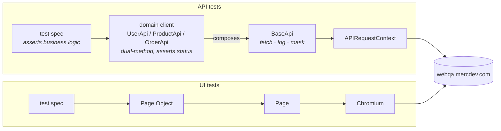
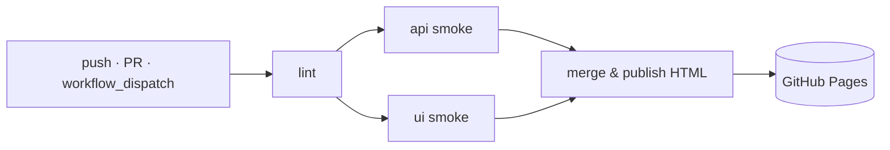

# WebQA — Playwright API + UI Test Framework

Production-grade SDET reference framework for **PayForm** (`webqa.mercdev.com`) — signup, login, catalog, and checkout flows tested at the API and UI level with a single TypeScript codebase.

[](https://github.com/maksimtrs/WebQA3/actions/workflows/playwright.yml)
[](https://maksimtrs.github.io/WebQA3/)
[](https://nodejs.org)
[](https://www.typescriptlang.org)

The latest HTML report from `main` is published at **<https://maksimtrs.github.io/WebQA3/>**.

---

## Quick start

```bash
# 1. Prereqs: Node 20 (use .nvmrc)
nvm use

# 2. Install
npm ci
npx playwright install --with-deps chromium   # UI suite only

# 3. Configure — copy .env.example → .env, fill in TEST_USER_EMAIL / TEST_USER_PASSWORD
cp .env.example .env

# 4. Run smoke (≈10s — 5 API + 3 UI tests)
npm run test:smoke

# 5. Open the local HTML report
npm run report
```

Selective runs:

```bash
npm run test:api          # 15 API tests
npm run test:ui           # 11 UI tests
npm run test:debug        # Playwright inspector
npx playwright test --grep @smoke
```

---

## Project layout

```
.github/
  workflows/playwright.yml       — lint → test (matrix) → publish-report → Pages
  actions/setup-node-deps/       — composite action: setup-node + npm ci
  dependabot.yml                 — weekly SHA bumps for actions + npm
tests/
  api/                           — *.spec.ts — REST endpoints (auth, products, user, orders)
  ui/                            — *.spec.ts — browser flows (login, signup, purchase)
  helpers/
    baseApi.ts                   — transport: fetch + log + mask, no domain knowledge
    userApi.ts / productApi.ts /
    orderApi.ts                  — domain clients (compose BaseApi)
    schemaValidator.ts           — AJV + json-schema-to-ts wrapper
    dialogHandler.ts             — native window.alert() promise helper
    envConfig.ts / logger.ts     — env loading + leveled, secret-masking logger
  fixtures/
    apiClients.fixture.ts        — authSession (worker), apiClients / anonClients (test)
    uiPages.fixture.ts           — mergeTests(uiTest, apiTest) — UI tests get API setup
  models/                        — request types + FromSchema-derived response types
  schemas/                       — JSON schemas (`as const satisfies JSONSchema`) — single source of truth
  data/                          — factories: cardFactory, userFactory, testUser
  pages/                         — Page Objects (BasePage / NavigablePage)
playwright.config.ts             — projects: api / ui; reporters: list, html, junit, github
eslint.config.mjs                — ESLint 9 flat config + eslint-plugin-playwright
tsconfig.json                    — strict, noUncheckedIndexedAccess, path aliases
Dockerfile / docker-compose.yml  — runs the suite in mcr.microsoft.com/playwright
```

---

## Architecture

Three-layer model — the call path for an API test:



**Why three layers and not two:** the transport layer (`BaseApi`) knows nothing about endpoints — it just sends, logs, and masks. The domain layer owns endpoint paths, payload typing, and status assertions. Tests own business assertions. This keeps the transport reusable, gives precise stack traces (failure points at the domain client, not a shared helper), and lets negative tests use the same domain object as positive ones.

**Dual-method domain pattern.** Every endpoint has two methods:

```ts
order.createAndPay(payload)         // happy path: asserts status, returns typed body
order.createAndPayResponse(payload) // raw: returns APIResponse, never asserts
```

Positive tests use the first; negative tests (`401`, `400`, validation errors) use the second.

**Schemas as single source of truth.** AJV schemas are declared with `as const satisfies JSONSchema`; response types are derived via `FromSchema<typeof schema>`. The same literal validates payloads at runtime and types the response at compile time — no drift.

```ts
// schemas/userSchemas.ts
export const userProfileSchema = { type: 'object', properties: { ... } } as const satisfies JSONSchema;

// models/user.ts
export type UserProfile = FromSchema<typeof userProfileSchema>;
```

---

## Fixtures

| Fixture | Scope | Purpose |
|---|---|---|
| `authSession` | **worker** | Logs in once per worker, registers JWT with the masking logger, shares the token across all tests in that worker. Saves N-1 logins. |
| `apiClients` | test | `{ user, product, order }` — domain clients wired with the worker's auth token. |
| `anonClients` | test | Same shape, no `Authorization` header. Used for signup, login, and 401 negatives. |
| `uiPages` (in `uiPages.fixture.ts`) | test | `{ loginPage, signupPage, productsPage, checkoutPage }`. Built on top of `apiClients` via `mergeTests` so UI tests can do API-driven setup (e.g. picking an in-stock product before paying). |

Both client sets ride the built-in `request` context — auth is per-request via header, not per-context.

---

## Configuration

Environment variables (read in `tests/helpers/envConfig.ts`):

| Var | Required | Default | Purpose |
|---|---|---|---|
| `BASE_URL` | no | `https://webqa.mercdev.com` | Target host. The API sits on the same origin. |
| `TEST_USER_EMAIL` | **yes** | — | Pre-seeded account for the worker session. |
| `TEST_USER_PASSWORD` | **yes** | — | Password for the above. |
| `LOG_LEVEL` | no | `info` | `error` / `warn` / `info` / `debug`. |
| `MASK_SENSITIVE` | no | `true` in CI | Emits `::add-mask::` directives so secrets never appear in CI logs. |
| `CI` | (auto) | unset locally | When set, the suite uses 2 workers, 2 retries, blob reporter, and the GitHub reporter. |

Copy `.env.example` to `.env` for local runs. CI receives them via repo secrets.

---

## CI / CD



The pipeline lives in `.github/workflows/playwright.yml`. Highlights:

- **Matrix `test` job** — `api` and `ui` legs run in parallel; only `ui` installs browsers.
- **Browser cache** keyed on `runner.os` + `runner.arch` + the resolved `@playwright/test` version (parsed from `package-lock.json` so the cache invalidates on real upgrades, not on range bumps).
- **Blob reporter** in CI; `playwright merge-reports` builds one combined HTML report from both legs and deploys it to GitHub Pages on `push`/`workflow_dispatch`.
- **Fork-PR secret guard** — the `test` job is skipped on PRs originating from forks; `TEST_USER_*` secrets are never injected into untrusted workflow code. Maintainers can re-run by pushing the branch into the repo.
- **Least-privilege permissions** — `contents: read` is the workflow default; `pages: write` and `id-token: write` are scoped to the `publish-report` job only.
- **SHA-pinned actions** + `dependabot.yml` — every `uses:` references a 40-char commit SHA with the version tag in a comment; Dependabot opens weekly grouped PRs to bump pins.
- **Concurrency** cancels superseded PR runs but never cancels an in-flight push to `main`/`master`, so a deploy is never aborted mid-publish.

---

## Logging & secret masking

`tests/helpers/logger.ts` provides leveled logging with built-in masking:

- Sensitive values are registered explicitly: `registerSensitiveValue(jwt)`. The logger replaces them with `***` in all subsequent output.
- In CI (`CI=true`), each registration also emits `::add-mask::<value>` so GitHub's runner masks the value across the entire workflow log — including any output the framework didn't produce.
- Sensitive **keys** (`authorization`, `password`, `cookie`, `cvv`, …) are masked by name when objects are stringified, so request/response logs never leak even if a value wasn't pre-registered.
- `BaseApi.send` logs every request and response at the appropriate level (`debug` for 2xx, `warn` for 4xx, `error` for 5xx).

---

## Docker

```bash
npm run docker:build        # docker compose build
npm run docker:test:smoke   # run @smoke inside the container
npm run docker:test:api     # API project only
npm run docker:test:ui      # UI project only
```

The image is based on `mcr.microsoft.com/playwright` (browsers + OS deps preinstalled). `playwright-report/` and `test-results/` are bind-mounted from the host, so the HTML report and traces stay accessible after the container exits. Env vars come from the host `.env`.

---

## Scripts

| Command | What it does |
|---|---|
| `npm test` | All projects (`api` + `ui`) |
| `npm run test:api` / `test:ui` | Single project |
| `npm run test:smoke` | `--grep @smoke` across both projects |
| `npm run test:smoke:api` / `test:smoke:ui` | Smoke for one project |
| `npm run test:debug` | Playwright inspector (step-through) |
| `npm run test:headed` | UI tests in a visible browser |
| `npm run report` | Open the local HTML report |
| `npm run lint` / `lint:fix` | ESLint check / auto-fix |
| `npm run docker:*` | See [Docker](#docker) |

---

## Tech stack

| | Version | Why |
|---|---|---|
| Playwright | `^1.59.1` | Test runner, fixtures, request context, browser automation |
| TypeScript | `^5` (strict + `noUncheckedIndexedAccess`) | Type safety, schema-derived response types |
| Node.js | `20` (LTS, pinned via `.nvmrc`) | Runtime |
| ESLint | `9` flat config + `eslint-plugin-playwright` | Linting (idiomatic Playwright + TS) |
| AJV | `^8` | Runtime JSON Schema validation |
| `json-schema-to-ts` | `^3` | Compile-time `FromSchema` type derivation |
| `@faker-js/faker` | `^9` | Test data generation |
